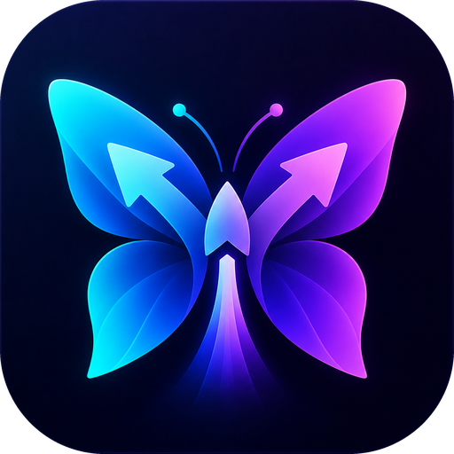

<p align="center">
  
</p>

<h1 align="center">WingDrop</h1>

<p align="center">
  Fast, calm, local file sharing for Android. Flutter UI, native C++ transfer engine.
</p>

<p align="center">
  <a href="https://github.com/Neo-vortex/WingDrop/actions/workflows/android.yml"></a>
  <a href="https://github.com/Neo-vortex/WingDrop/releases/latest"></a>
</p>

## Download

Signed APKs are published on the [Releases](https://github.com/Neo-vortex/WingDrop/releases) page by CI on every push to `main`. Most phones want the `arm64-v8a` APK. The version is `major.minor.<build number>`, so a higher number is always newer.

## Layout

| Path | What |
|---|---|
| `android/app/src/main/cpp/engine.*` | Transfer engine: any number of concurrent send/receive sessions; per session N parallel TCP streams fed from one chunk queue; per-stream producer/committer pipeline; `sendfile`/`splice` zero-copy for raw data and `MSG_ZEROCOPY` for prepared payloads; adaptive LZ4 → zstd(-1/1/3) driven by who waits on whom; chunk bitmaps for resume; `fallocate` + streaming writeback |
| `android/app/src/main/cpp/vortex.*` | Vortex tunnel (after [VortexTunnel](https://github.com/Neo-vortex/VortexTunnel)): `[u32 len][u8 flag]` framing, X25519 + pairing-key handshake, sequence nonces, optional plain mode |
| `android/app/src/main/cpp/aegis.*` | AEGIS-128L on ARMv8 AES / x86 AES-NI, IETF known-answer self-test at startup; XChaCha20-Poly1305 (Monocypher) fallback |
| `android/app/src/main/cpp/perf.*` | Big-core affinity, raised priority, ADPF performance hints |
| `android/app/src/main/cpp/bench.*` | Built-in device benchmark |
| `android/app/src/main/cpp/media.*` | Media shrinking with the bundled FFmpeg 8 (LGPL) and MediaCodec hardware encoders |
| `android/app/src/main/kotlin/ir/neovortex/wingdrop/` | Wi-Fi Direct / local hotspot (2.4/5/6 GHz, WPA2/WPA3), DNS-SD discovery, MediaStore/SAF fds, QR scanner (CameraX + ZXing), HEIC, installer |
| `lib/` | Flutter UI (BLoC), English + Persian |

## Wire protocol (v2)

1. Control connection: 64-byte Hello, BLAKE2b-authenticated with the QR key, a trusted-device bond key, or the advertised radar key. Then the Vortex handshake (X25519 always; message encryption only in secure mode), then options (with sender identity and a stable transfer id) and the manifest.
2. `READY(status, receiver caps, bond offered, receiver device id, chunk bitmap)`. The sender skips chunks the receiver already has, which is how resume works.
3. Data connections (one per stream): Hello authenticated with the session data key, then `FrameHeader(24 B) + payload`. The payload is raw, LZ4 or zstd, and/or AEAD (AEGIS-128L or XChaCha20-Poly1305) with the header as associated data.
4. The receiver sends `DONE` only after every byte has been written.

Trust levels: a QR pairing or a bond is let in directly. The radar key needs the receiver's approval ("Accept" or "Accept and remember them"). A bond is derived from the X25519 session and stored by both phones.

Follow-up sessions: while media is still being shrunk, the ready files go first. Once the receiver accepts, both sides derive a follow-up key from the session (BLAKE2b "wdr-follow"); the shrunk files then come in a second session authenticated with it, with no second approval. Receivers keep these keys in memory for 30 minutes.

Resume: on failure the receiver keeps the partial files and the chunk bitmap, keyed by transfer id, for 24 hours.

## Build

```
flutter build apk --release --split-per-abi
```

`libffmpeg.so` in `android/app/src/main/jniLibs` is a prebuilt LGPL FFmpeg 8 build (avbuild), with headers in `cpp/third_party/ffmpeg/include`. Other vendored code: LZ4 (BSD), zstd 1.5.7 (BSD), Monocypher (BSD-2/CC0), Nunito and Vazirmatn fonts (OFL).
